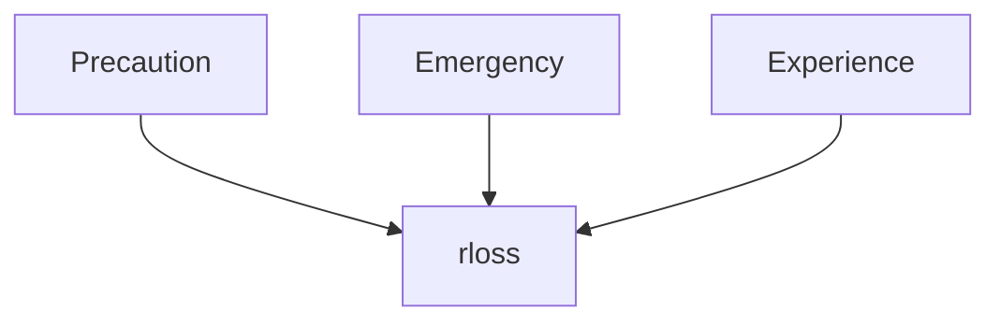

Q4 Analysing flood-related vulnerabilities of companies 
=====

Personal Information
--------
#### Student
[Tobias Sieg](<tsieg@gfz-potsdam.de>)

#### Institution
University Potsdam & GFZ

#### Supervisors
Prof. Dr. Bruno Merz
Dr. habil. Heidi Kreibich

Main Topic
------
Identify and quantify the main damage explaining variables on the base of empirical data obtained from the flood event 2002 and 2013 in Germany.

Data available 
-----
- Survey data of companies obtained after flood events in Germany conducted by an professional company

| River  | State | Year    | Number of observations  |
|-------|:---:|-----------|-------:|
| Elbe  | Saxony | 2002     | 280 |
| Danube | Bavaria | 2013      | 300  |

References
----

Methods
----
Multivariate methods like random forests or bayesian networks should be used in order to identify interactions between variables.

